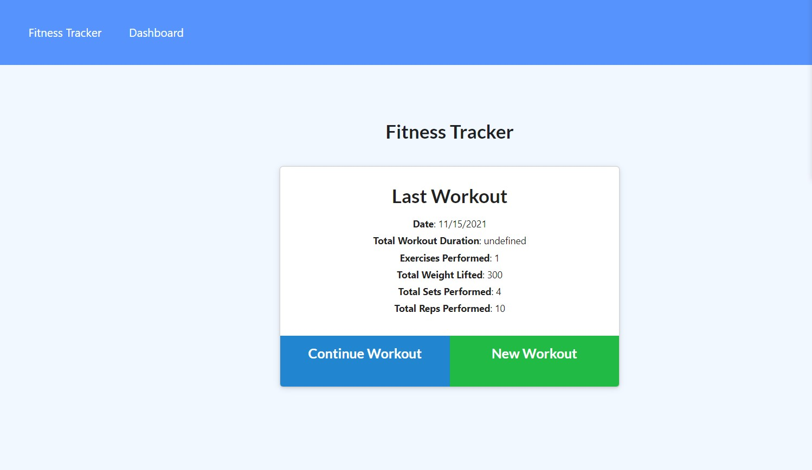

# fitness-tracker

## Description
`This is a Employee Tracker application that allows a user to add a work out with how long youve worked out, the amount of weight you lifted as well as how many reps you've accomplished. A user is also able to edit and delete a work out.` 

## Function

This application allows a user to add, edit and continue a saved workout. Simply answer the prompts and it will generate a saved workout, so a user can track their fitness.

## Credits

I would like to give credit to my Varsity Tutor for helping me understand how to add routes, and link with mongoose.

## Table of Contents

[Description](#description)

[Study-Material](#Study-Material)

[Features](#features)

[Links](#links)

[Repository](https://github.com/jmoniz155/fitness-tracker)

[Live Website](https://jmoniz155.github.io/fitness-tracker/)

## Study-Material

[Mongodb](https://www.mongodb.com/)

[Mongodb Methods](https://docs.mongodb.com/mongodb-shell/reference/methods/)

[Mongoose](https://mongoosejs.com/docs/5.x/docs/models.html)

[Express](https://expressjs.com/en/starter/hello-world.html)

[Mozilla Json Stringify](https://developer.mozilla.org/en-US/docs/Web/JavaScript/Reference/Global_Objects/JSON/stringify)

## Features

This app was built using HTML 3, CSS 6, Javascript, Mongoose, and Express

## Links

[Repository](https://github.com/jmoniz155/fitness-tracker)

[Live Website](https://jmoniz155.github.io/fitness-tracker/)

`Jesse Moniz: UCSD coding student in San Diego, CA`

| Name          | Email                 | Github                        | Linkedin                                              |
| ------------- | --------------------- | ----------------------------- | ----------------------------------------------------- |
| Jesse Moniz   | Jmoniz155@gmail.com   | https://github.com/jmoniz155  | https://www.linkedin.com/in/jesse-moniz-98693621a/    |